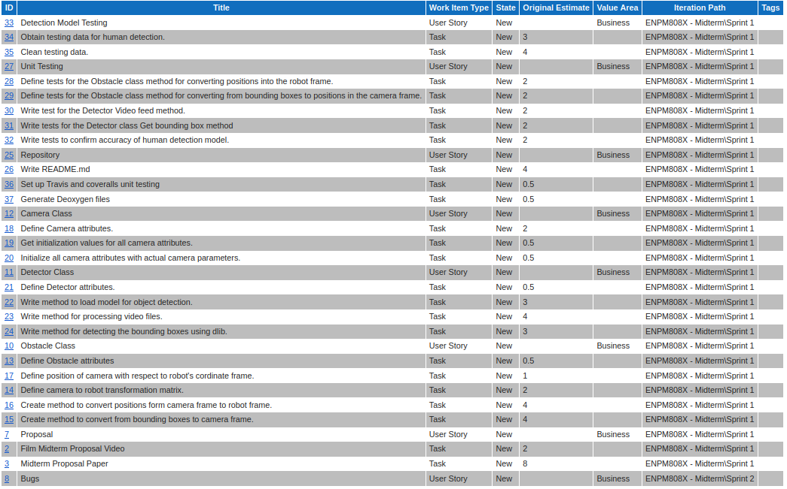

# Human-Detector-And-Tracker

[](https://app.travis-ci.com/SamPusegaonkar/Human-Detector-And-Tracker)
[](https://coveralls.io/github/SamPusegaonkar/Human-Detector-And-Tracker?branch=main)
[](https://opensource.org/licenses/MIT)


---

A software module for Acme's MediBot robot to detect &amp; track humans. 

# Team Members:

- [Shon Cortes](https://github.com/shonbc/)
- [Sameer Pusegaonkar](https://github.com/sampusegaonkar/)

# Phase 0
## Proposal Video for the project:
Video can be found [here](https://www.youtube.com/embed/TuUaH0ptrn0):

## Written Proposal:
A 2 Page Written proposal can be found [here](https://github.com/SamPusegaonkar/Human-Detector-And-Tracker/blob/main/docs/initial/Proposal.pdf)

***
# Phase 1
## Update Video for the project:
Video can be found [here.](https://youtu.be/4Fnji_aOBQk)

## Product Backlog:
All backlog is being tracked [here.](https://docs.google.com/spreadsheets/d/1d91Km6jjr7IpjPjCiHpYYn6EU4wXOL3bwWk6Ny9Gc3k/edit#gid=0)

## Iteration Planning Meetings & Scrum Meeting Notes:
Can be found [here.](https://docs.google.com/document/u/5/d/1nzskLJN1WSXA-vDnfdTdaYm-gOQvoOS33DXtdwem0go/edit#heading=h.qk4i5j7fr8g4)
***

## Build and Run Instructions:
Clone repo:

    git clone https://github.com/SamPusegaonkar/Human-Detector-And-Tracker

Download model files:

    ./download_model_files.sh

Build with coverage on or off:

    ./build_with_coverage.sh

    or

    ./build_coverage_off.sh

Run the main file to demo the API in use:

    cd build
    ./app/shell-app

Generate cppcheck, cpplint and valgrind results and store in a text file in /results directory:

    ./run_cpplint.sh

    ./run_cppcheck.sh

    ./run_valgrind.sh

Generate Doxygen files:

    doxygen Doxyfile

# Introduction: 
MediBot: A 4 wheeled mobile robot developed by Acme Robotics has become an essential part of all hospitals across the state. This robot travels through hallways to deliver medicines reliably to their patients. Given the drastic increase in the number of patients, nurses, doctors during pandemics & flu seasons [[1](https://ourworldindata.org/covid-hospitalizations),[2](https://www.cdc.gov/coronavirus/2019-ncov/covid-data/covidview/index.html)] this robot needs to make sure that it doesn’t get obstructed by any humans when it travels through the hallways.

MediBot is built on an x64 architecture[[3](https://en.wikipedia.org/wiki/X86-64)] that uses a microprocessor that runs Ubuntu 18.04 operating system[[4](https://releases.ubuntu.com/18.04/)]. We plan to implement a real-time software module for detecting & tracking humans by providing their location information with respect to the robot’s coordinate frame. The robot coordinate frame is at the center of mass & the camera’s coordinate frame will be at the center of the camera mounted on top of the robot. The camera system is monocular & parameters such as the Field Of View, distortion coefficients, frame rate & its position are known. All other calculations will be done in SI units.

This video input from the camera will be processed by a machine-learning model to detect humans. Corresponding location information can be then found out with respect to its camera frame. Since the robot is given input in terms of x & y coordinates, we will transform these coordinates into the robot’s reference frame. The z coordinates are ignored since we only have a monocular camera. Once that is done this information can then be used by Acme Robotics to understand where humans are with respect to MediBot’s position & eventually avoid them.

<p align = "center">


<p align = "center"><em>Figure 1. MediBot</em></p>
</p>

# Project Organization:
The Agile development process will be used to ensure the quality of work and task tracking. Our team consists of two people, Sameer Pusegaonkar & Shon Cortes, expecting to work 10 hours during each one-week sprint. This means our iteration capacity is 20 hours. Product backlogs[Fig. 2], sprint progress, bugs fixes, time logs, and test plans will be tracked using Azure DevOps. 
An initial UML activity and class diagram, [Fig. 3, 4], has been made outlining the flow of the program which has fed our initial product backlog. During each sprint, bug catches and new features will be tracked and added to the backlog to be handled during the next sprint. Daily scrum meetings will be held to discuss progress and address sticking points. We will use pair programming to assist in solving any problems an individual team member encounters as needed. At the end of each sprint, the code and product backlog will be evaluated during an iteration review in preparation for the next sprint. Unit tests will be designed using the google test library to ensure full code coverage and proper operation. Git will be the primary tool for version control and tracking. 

<p align = "center">



<p align = "center"><em>Figure 2. Product Backlog</em></p>

</p>

<p align = "center">


<p align = "center"><em>Figure 3. Class Diagram - On the left</em>


<p align = "center"><em>Figure 4. Activity Diagram - On the right</em></p>

</p>


# Managerial Process:
Testing will be done on the entire codebase. This includes unit testing, integration testing & regression testing. V-Model will be followed for the development & testing of our code. To test the accuracy of the model we will be collecting pre-labeled data. The model will only be accepted if it has an accuracy above 80%. A backup plan to implement a color tracker or template matching will be set up if the above technique falls below the 80% desired threshold accuracy.
A potential flaw that could come up is that because of the constraint of a monocular camera, a large tolerance in position will be noticeable due to the use of the average height of humans. Variations in lighting conditions can also cause errors in position estimation as well as increase the difficulty in obstacle detection. Ideally, depth estimation would be done with a stereo vision system using two cameras. In this application, we are restricted to a singular monocular camera system which may increase our margin of error as well. Our timeline is ambitious given we are a small team and will be working under short sprints. 

# Technical Process:
To get the location information of humans, we will be utilizing a pre-trained model called mobilenet[[5](https://arxiv.org/abs/1704.04861)] which will allow us to get bounding boxes for detected objects. MobileNet is based on a streamlined architecture that uses depth-wise separable convolutions to build lightweight deep neural networks[[5](https://arxiv.org/abs/1704.04861)]. Because of the constraints of the robot hardware, mobile net was picked as it achieves comparable results to other networks like RCNN, Faster CNN with only a fraction of computationally complexity and model size[[5](https://arxiv.org/abs/1704.04861)]. This model outputs the bounding boxes for N>=1 humans. A correlation filter will be used to track each and every one of these instances of humans using DLib[[6](http://dlib.net/imaging.html)].
Once that information has been obtained in the camera’s reference frame, this information could be transformed into the robot's reference frame. This process is done by computing a similarity triangle. Since we are aware of the focal length, field of view of the camera, and the width and height of the humans in pixels, this information can be converted into the x coordinate for the robot which is the z coordinate for the camera frame. Using the depth information, we can determine the human’s y position (horizontal position in the camera frame) by mapping horizontal pixel locations to physical horizontal positions. While this is an estimation for the actual x and y coordinates, the method is robust for the purposes of Acme’s Medibot.

<p align = "center">


<p align = "center"><em>Figure 5. Robot Coordinate Frame Calculations</em></p>

</p>

# Work Packages:
- C++ 11 & (above features)[[7](https://isocpp.org/)] will be the primary language for the entire codebase. 
- We will be utilizing Cmake 3.2.1 & Above [[8](https://cmake.org/)] for our build system. 
- For processing our video input, OpenCV 4.5.3 (Apache 2 license)[[9](ttps://github.com/opencv/opencv)]will be used.
- DLib 19.22 (Boost Software License - Open Source)[[6](http://dlib.net/imaging.html)] for implementing the tracking functionality. 
- MobileNet [[5](https://arxiv.org/abs/1704.04861)] Configuration Files.
- Eigan 3.4 (MPL2 License) [[10](http://eigen.tuxfamily.org/index.php?title=Main_Page#License)] used for liner algebra implementation.
- JSONCPP [[11](https://github.com/open-source-parsers/jsoncpp)] to parse the configuration information for the test data & get the bounding boxes.


At the end of this contract, Acme Robotics will receive a well-documented & fully tested software module that can detect and track humans while returning their position in the robot frame. 

# Known Issues (so far)
```
1. Failed to load module "canberra-gtk-module". 
```
Issue occurs using the .detect method from the Detector class. 

This issue could be solved by proper installation of OpenCV. Ideally, should be install all the dependencies of opencv which we avoided.


# Quad Chart:

<p align = "center">


<p align = "center"><em>Figure 6. Quad Chart</em></p>

</p>


# References:


[1] https://ourworldindata.org/covid-hospitalizations

[2] https://www.cdc.gov/coronavirus/2019-ncov/covid-data/covidview/index.html

[3] https://en.wikipedia.org/wiki/X86-64

[4] https://releases.ubuntu.com/18.04/

[5] MobileNets: Efficient Convolutional Neural Networks for Mobile Vision Applications - https://arxiv.org/abs/1704.04861

[6] http://dlib.net/imaging.html

[7] https://isocpp.org/

[8] https://cmake.org/

[9] https://github.com/opencv/opencv

[10] http://eigen.tuxfamily.org/index.php?title=Main_Page#License

[11] https://github.com/open-source-parsers/jsoncpp
